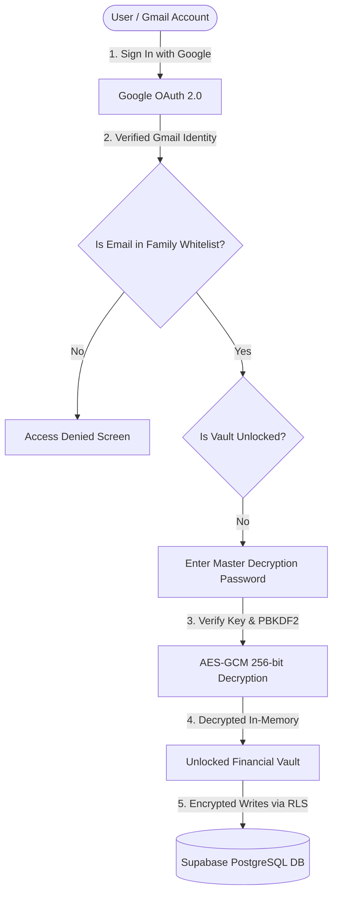

# How to Integrate Google Login & Supabase DB with Family Asset Vault

This guide provides step-by-step instructions for connecting your **Google Account (Gmail)** and **Supabase Database** to the Family Asset Vault application with **AES-256 Client-Side Encryption**, **Master Password Decryption**, and **Whitelisted Family Login Permissions**.

---

## Multi-Layer Security Architecture



- **Layer 1 (Google OAuth Identity)**: Only Google-authenticated sessions can interact with the app.
- **Layer 2 (Gmail Whitelist Access Control)**: Only specific authorized family emails (e.g. `yourfamily@gmail.com`) can proceed. Any other Gmail account is shown an Access Denied screen.
- **Layer 3 (Master Decryption Password)**: Financial balances, account numbers, PAN, and Aadhaar are encrypted at rest with AES-GCM 256-bit. A master password is required to derive the cryptographic key and decrypt the records in memory.
- **Layer 4 (On-Demand Vault Lock)**: You can lock the vault at any time using the **Lock Vault** button in the navbar without signing out of Google.

---

## Step 1: Create a Free Supabase Project

1. Go to [https://supabase.com](https://supabase.com) and sign in (or create a free account).
2. Click **"New Project"**.
3. Choose an **Organization**, enter a **Project Name** (e.g. `family-asset-vault`), set a secure **Database Password**, and select a region (e.g. `South Asia (Mumbai)`).
4. Wait ~1 minute for Supabase to provision the database.

---

## Step 2: Run the Database Schema in Supabase

1. In your Supabase dashboard, click **SQL Editor** on the left menu.
2. Click **"New query"**.
3. Open the file `supabase/schema.sql` in this repository and copy its entire contents.
4. Paste the SQL into the Supabase query editor and click **Run** (or press `Cmd + Enter`).
5. This creates all relational tables (`family_members`, `financial_years`, `bank_accounts`, `bank_snapshots`, `investments`, `insurance_policies`, `immovable_properties`, `movable_assets`, `liabilities_expenses`) with **Row Level Security (RLS)**.

---

## Step 3: Configure Google Cloud OAuth

To allow Gmail login, you need a Google OAuth Client ID and Secret:

1. Go to the [Google Cloud Console](https://console.cloud.google.com/).
2. Create a new project (e.g., `Family-Asset-Vault`) or select an existing one.
3. In the left navigation, go to **APIs & Services** > **OAuth consent screen**:
   - Select **External** (or Internal if using Google Workspace).
   - Enter **App name**: `Family Asset Vault`.
   - Enter your **User support email** (your Gmail address).
   - Enter **Developer contact email** (your Gmail address).
   - Click **Save and Continue** through the Scopes and Test Users screens.
4. In the left navigation, go to **APIs & Services** > **Credentials**:
   - Click **+ Create Credentials** > **OAuth client ID**.
   - Select **Application type**: **Web application**.
   - Name: `Family Asset Vault Client`.
   - Under **Authorized JavaScript origins**, add:
     ```
     http://localhost:5173
     ```
   - Under **Authorized redirect URIs**, add your **Supabase Callback URL**:
     ```
     https://<YOUR-SUPABASE-PROJECT-REF>.supabase.co/auth/v1/callback
     ```
     *(You can copy this exact URL from your Supabase Dashboard: Authentication > Providers > Google)*.
   - Click **Create**.
5. Copy the generated **Client ID** and **Client Secret**.

---

## Step 4: Enable Google Provider in Supabase

1. In your **Supabase Dashboard**, navigate to **Authentication** > **Providers**.
2. Find **Google** in the list and click to expand it.
3. Toggle **Enable Google provider** to **ON**.
4. Paste the **Client ID** and **Client Secret** obtained in Step 3.
5. Click **Save**.

---

## Step 5: Connect Family Asset Vault to Your Supabase Project

1. In Supabase Dashboard, go to **Project Settings** > **API**.
2. Copy your **Project URL** and **anon / public key**.

### Via the In-App Settings:
1. Open [http://localhost:5173](http://localhost:5173).
2. On the login screen, click **Config** next to "Supabase Cloud".
3. Paste your **Project URL** and **Anon Key**.
4. Click **Save & Connect Supabase**.
5. Click **Continue with Google Sign-In**!

---

## Step 6: Setting Master Decryption Password & Access Permissions

1. **Sign In**: Click **"Sign In with Google Account"** and pick your authorized Gmail.
2. **Set Master Password**: The app will prompt you to set your **Master Vault Password**.
3. **Decrypted Access**: Once entered, your records from `Assets Liabilities Details FY 23-24.xlsx` are decrypted and loaded into view!
4. **Manage Authorized Family Emails**:
   - Click the **Database** icon in the navbar.
   - Under **"Authorized Family Gmail Logins"**, you can add or remove family member emails (e.g. `spouse@gmail.com`).
   - Anyone logging in with a non-whitelisted Gmail will be blocked automatically.
5. **Lock Vault**: Click **Lock Vault** in the top navbar anytime to lock the screen and require the password again.
